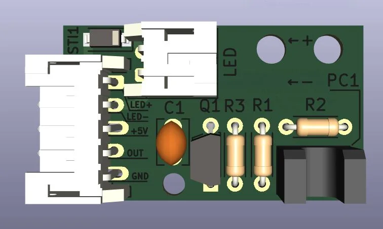

# SHINSANWASWITCH

DIY-friendly photointerrupter microswitch/lamp holder 2-in-1 for generic 100mm Chinese arcade buttons. Enables an OBSA-LHSXF+OBSA-100UMQ-like setup at low cost with generic parts.

## Updates
- Now we are corrently working on SHINSANWASWITCH update version 1.1 with some optimizations that needs to be verified, so now everything is divided into two parts: v1 and v1.1 . If you want corrently stable version - use everything that named "v1". 
Version 1.1 has some optimizations in body of SHINSANWASWITCH and possibility to make different variants of PCB to make with possibility to make one-layered-board at home (if you have anought skill). More info here:  https://www.projectdiva.net/community/threads/shinsanwaswitch-blog-of-creating-diy-analog-of-obsa-lhsxf-ln.2325/page-2#post-18644

## Parts list

### Electrical

- PCB: 1x `shinsanwaswitch_PCB` **1mm thickness** (KiCad 5.99+ (5.99.0-11737-gca42f31bb5), release build required for exporting Gerber files or take Gerber files archive in `Gerber/shinsanwaswitch_v1.zip`)
  - C1: Generic 0.1uF through hole ceramic capacitor.
  - D1: `NSI45020AT1G`.
  - J1: `S5B-PH-K-S` or equivalent.
  - LED: `S2B-PH-K-S` or equivalent.
  - PC1: `RPI-352`.
  - Q1: `2SC5395-F` or equivalent (may be rare but can be found on e.g. aliexpress).
  - R1: 330ohm 5% 1/4W through hole.
  - R2: 22kohm 5% 1/4W through hole.
  - R3: 10kohm 5% 1/4W through hole.
- 1x harness
  - 5x Single-ended **JST PH** wires (can be found on e.g. aliexpress or alternatively you can crimp them yourself)
  - 1x JST `PHR-5` or equivalent.
- 1x LED assembly (no resistors required)
  - 2x **JST PH** to **.1" female** wires (can be found on e.g. aliexpress or alternatively you can crimp them yourself. Can be made by soldering single-ended JST PH wire and .1" female wire together and wrapping each wire with heat shrink tubing).
  - 1x 20mA through hole white LED (plugs into the .1" female connector).
  - 1x JST `PHR-2` or equivalent.
  - 1x 2 pin .1" female connector housing.
  

### Pin mapping

I/O port (from up to down):

| \#  | Description |
| --- | ----------- |
|  1  | LED+ |
|  2  | LED- |
|  3  | +5V |
|  4  | OUT |
|  5  | GND |

LED connector (from up to down):

| \#  | Description |
| --- | ----------- |
|  1  | + |
|  2  | - |

### Mechanical

- 3D printable parts (printing in resin recommended for best accuracy but not required)
  - 1x `STL/body.STL`
  - 1x `STL/cap.STL`
  - 3x `STL/lever_*.STL` (because of possible differences of generic 100mm Chinese arcade buttons and possible differences in preferences of players that will use it there available 3 different lengts of levers that you should print separately (and better in different colors) and then determine from your own experience what is best for you)
	- 1x `STL/lever_long.STL`
	- 1x `STL/lever_middle.STL`
	- 1x `STL/lever_short.STL`
- 1x 0.3x6x10mm (wire thickness x outer diameter x length) spring (can be found on e.g. aliexpress).
- 2x M2x8 screws

### Example of 3D-print settings that were used
- Layer height: 0.12mm (can be less, but not more, because quality depends on it)
- Nozzle: 0,4mm (can be less, of course)
- Fill level: 25%
- Number of wall lines: 4
- Number of cover layers: 4
- Number of bottom layers: 4
- Supports: only from the bed
- Filament: PETG
- Color: any, but the lever must be black or the part of lever that crosses the optocoupler must be painted with a marker in black in several layers, otherwise the optocoupler will work incorrectly and the switch will not work correctly.

## Source files
In folder `source` there are available source files that used to create 3D-models in SolidWorks. You can use them to make your modification, if you need it.
